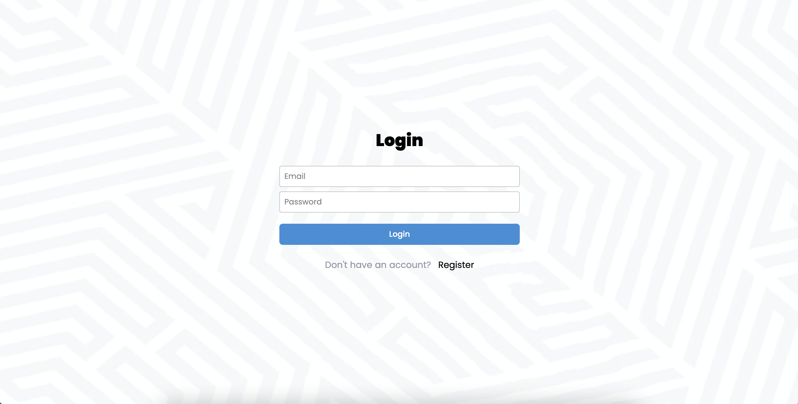
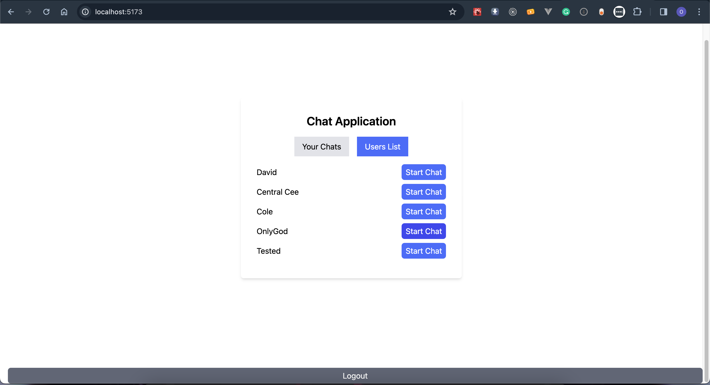
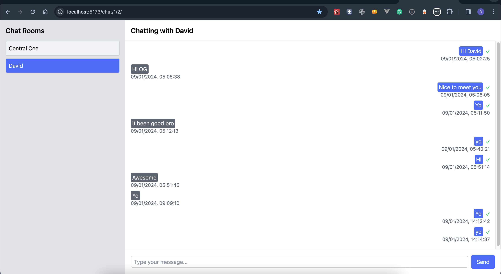

# Django Chat Web React app

## Main Features

- Sign Up and Login
- Logout
- API routes
- Real-time chat using WebSocket.

## Live Demo
Explore the live demo [here](your_live_demo_link).

## System Overview (UML Diagram)

Systm UML Diagram

 <a href="https://drawsql.app/teams/onlygs-team/diagrams/chat" target="_blank">
<div align="start">

</div>
</a>

## Prerequisites

- Python 3.9 or greater
- Virtualenv (recommended for creating virtual environments) if using Docker
- Django (installed in your project)


## Installation and Setup Guide - Backend (Django) 

```bash
   git clone https://github.com/Onlynfk/django-social-media-web-app.git

   cd backend

   pip install -r requirements.txt

   python manage.py migrate

   python manage.py runserver

   Your backend is now running at http://localhost:8000.


```

## Installation and Setup Guide - Backend (Django) with Docker

```bash
   git clone https://github.com/Onlynfk/django-social-media-web-app.git

   cd backend
   
   sudo docker compose build # installs python version and project requirements
   
   sudo docker compose up -d  # starts the docker container
   
   Your backend is now running at http://localhost:8000.


```

## Installation and Setup Guide - Frontend (ReactJS)

```bash

    cd frontend

    yarn install

    yarn run dev

    Your frontend is now running at http://127.0.0.1:5173.

```

## Frontend Screenshots

<div align="start">

</div>

## Above is the Login Screenshot


<div align="start">

</div>

## Above is the Chat/Users List Screenshot

<div align="start">

</div>

## And Lastly the Chat Screenshot